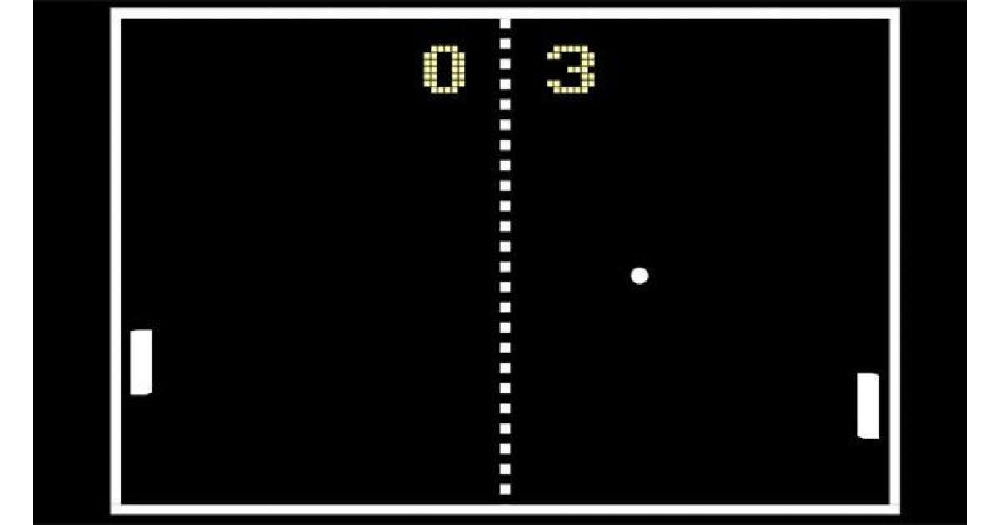

# 兵乓球遊戲

## 遊戲示意圖

## 遊戲說明

可以與電腦對手以及真人對手進行對戰，玩家需要嚴密的防守，將對手的球一一打擊回去，而對方失手沒接住球，就能讓你獲得一分，只要能在與對手競爭的過程中，得分首先達到 11 分，玩家就能贏得該場比賽。

## 操作說明

1P 位置在右側，可使用鍵盤或滑鼠進行操控。
+ K - 往上移動
+ M - 往下移動

2P 位置在左側，僅可使用鍵盤進行操控。
+ A - 往上移動
* Z - 往下移動
